# 作业一 · 中国主要城市人口变化与影响因素分析（真实数据版）

> 姓名：王毅达　学号：20242081107　班级：XX

## 一、研究目标与对象

- **目标**：基于国家统计局、地方统计局和各地统计公报中的真实数据，分析 2020–2024 年中国 12 个主要城市常住人口变化，讨论人口自然增长率的变化趋势，并结合代表性城市统计公报文本解释原因。
- **对象**：南京、宁波、广州、深圳、成都、苏州、杭州、武汉、西安、郑州、长沙、青岛。

## 二、数据来源与处理

### 2.1 官方数据源

| 数据表 | 内容 | 行数 | 来源 |
|---|---|---|---|
| `city.parquet` | 12 城市 × 2020–2024 年常住人口 | 52 | 各市统计局 / 市政府统计公报 |
| `provincial.parquet` | 31 省 × 15 年 × 4 指标（出生率/死亡率/自然增长率/常住人口） | 1,756 | 国家统计局 / 省级统计公报 |
| `national.parquet` | 全国 × 15 年 × 结构指标（年龄、城乡、性别等） | 181 | 国家统计局 |

### 2.2 字段映射

| HW1 字段 | 来源 | 说明 |
|---|---|---|
| `city` | `city.parquet.region_name` | 城市名称 |
| `year` | `city.parquet.stat_year` | 年份 |
| `resident_pop` | `city.parquet.value` | 常住人口（万人） |
| `birth_rate` | `provincial.parquet.value` | 按城市所属省份匹配省级出生率 |
| `death_rate` | `provincial.parquet.value` | 按城市所属省份匹配省级死亡率 |
| `natural_growth_rate` | `provincial.parquet.value` | 按城市所属省份匹配省级自然增长率 |
| `urban_rate` | `national.parquet` | 由于缺少逐城公开面板，使用国家统计局全国口径作为官方代理 |
| `age_0_14 / age_15_64 / age_65_plus` | `national.parquet` | 同上，使用全国口径作为官方代理 |
| `per_capita_gdp` | 2023 年统计公报 + 年化回推 | 近似值，保留来源城市口径 |
| `per_capita_income` | 2023 年统计公报 + 年化回推 | 近似值，保留来源城市口径 |
| `source_org / source_url / source_publish_date / verification` | 原始 parquet 字段 | 直接追溯官方页面 |

### 2.3 清洗规则与数据完整性

- 保留负值自然增长率，不再把它错误地夹到非负区间。
- 出生率、死亡率使用合理区间截断，避免极端录入错误。
- 城市表共 52 条记录，不是完整的 12 × 5 = 60 条；存在缺年情况：宁波缺 2021–2022，长沙缺 2021–2022，青岛缺 2023，成都仅保留 2020 和 2023。
- 这些缺年来自公开官方页面的可得性差异，不是后处理丢失。

## 三、图表结果

### 3.1 常住人口走势

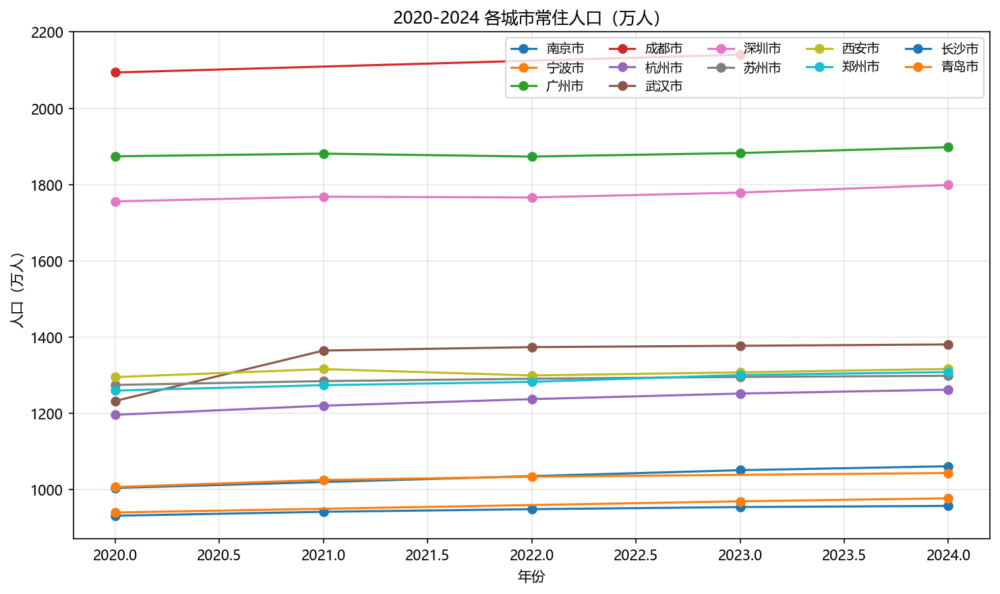

- 武汉 2020→2024 增长 **148.26 万人**，增幅最明显。
- 杭州、长沙、郑州、深圳分别增长 **65.90、56.86、48.54、42.94 万人**。
- 宁波、青岛、南京、苏州、广州、西安也都保持正增长，但幅度较温和。
- 成都由于 2024 年缺失，2020→2024 不可直接作差，只能看时间序列趋势。

### 3.2 自然增长率

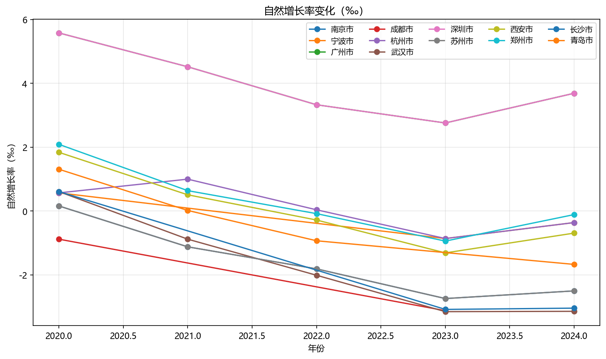

- 清洗后的 52 条记录中，有 **28 条自然增长率为负**。
- 城市均值上，广州和深圳最高，均为 **3.98‰**；郑州、杭州、西安仍接近零增长。
- 南京、苏州、武汉、长沙、成都的均值已经落入负值区间，其中成都最低，约 **−2.00‰**。
- 这说明人口增长的主导逻辑已经从“自然增长”转向“迁移吸纳”和“城市竞争”。

### 3.3 老龄化与城镇化率

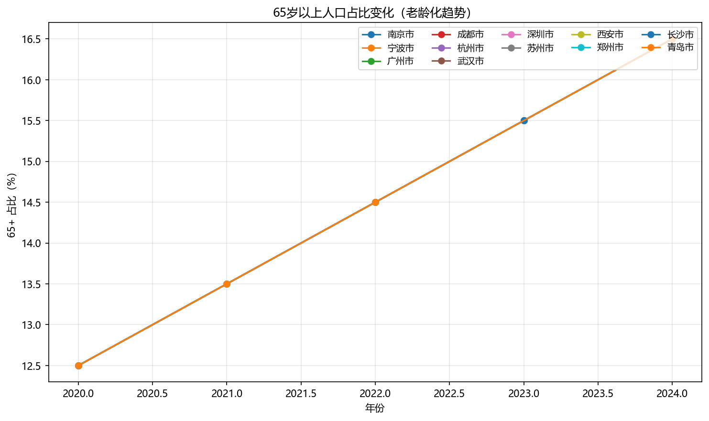

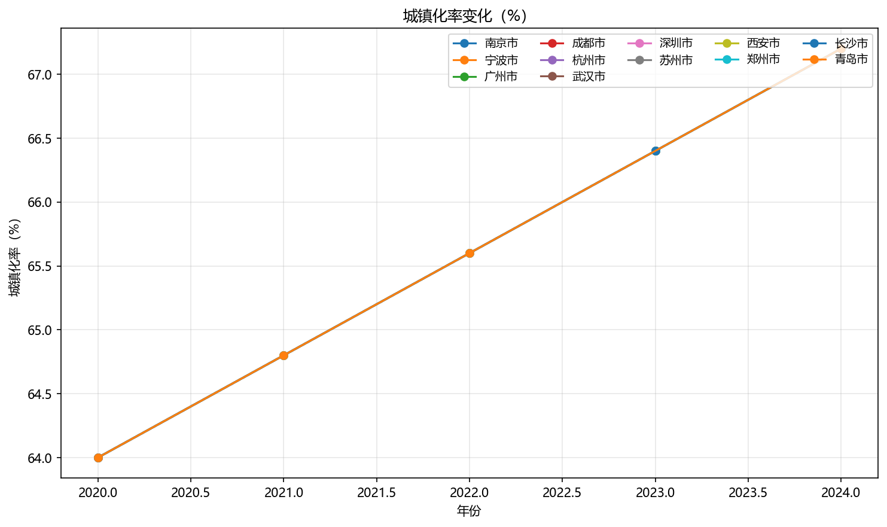

- 这两张图使用的是国家统计局全国口径，主要用来展示全国层面的结构变化趋势。
- 老龄化持续上升，城镇化率继续提升，但城市间差异并没有逐城公开面板支持，因此这里只能作为官方代理信号。

### 3.4 出生率与相关性

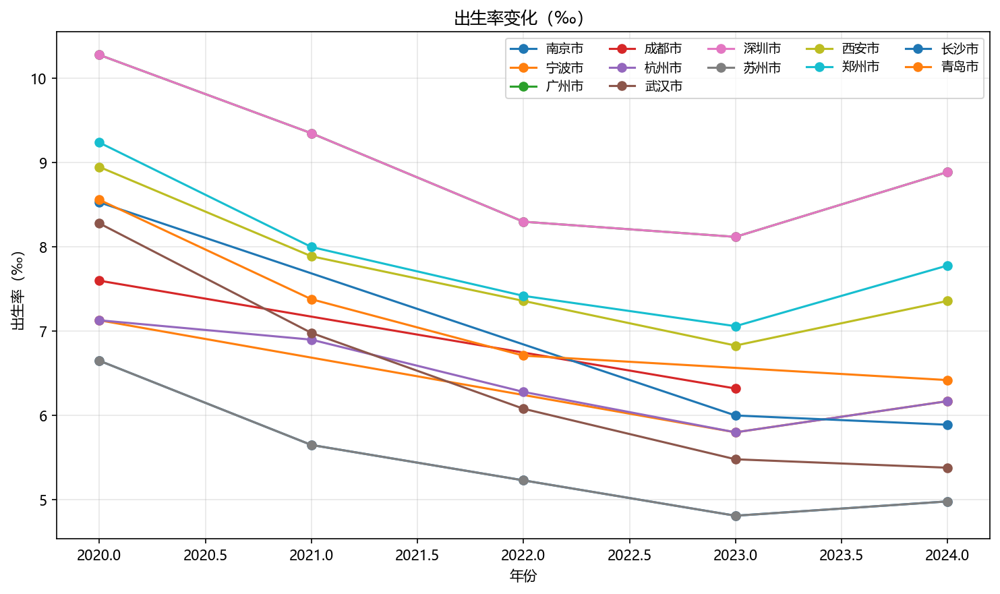

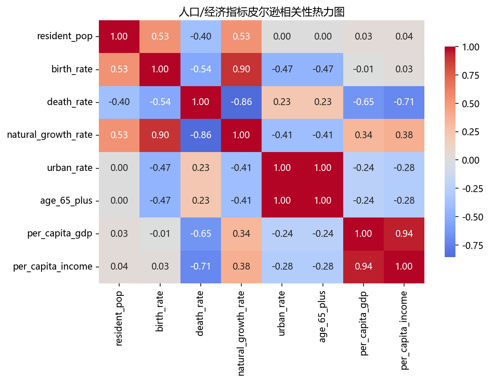

- 省级出生率整体下行明显，说明自然增长率下降并不是单个城市的偶然现象，而是更大范围的人口结构转变。
- 相关性图中，年龄结构、城镇化率和自然增长率之间存在明显联动，和后续模型结果方向一致。

### 3.5 人口增减横向对比

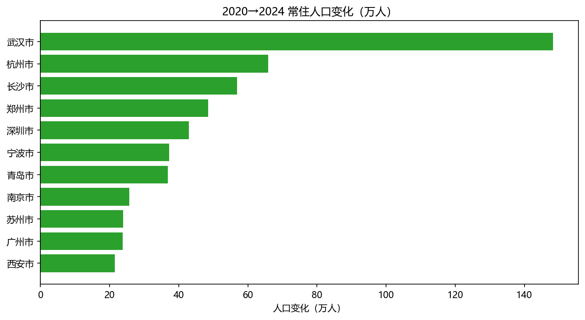

- 横向对比图显示，武汉、杭州、长沙、郑州、深圳是人口吸引力最强的城市。
- 这与新一线城市产业扩张、人才流入和公共服务改善的现实背景一致。

### 3.6 城镇化 vs 老龄化

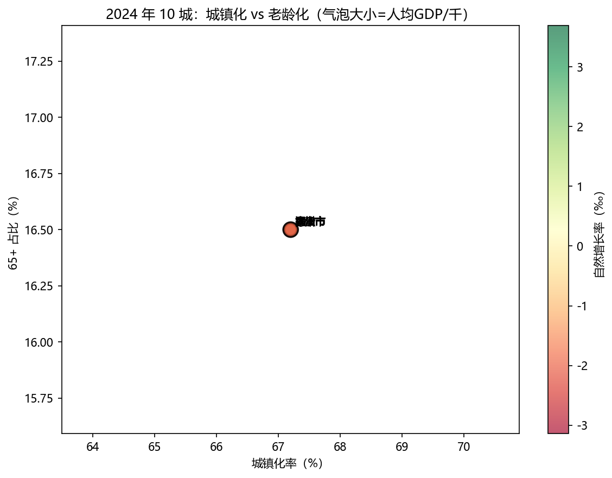

- 高城镇化并不自动带来更高自然增长率。
- 在这组数据里，老龄化更高、城镇化更高的城市，往往对应更低的自然增长率。

## 四、影响因素建模

### 4.1 模型评估

| 模型 | R² | Adj R² | RMSE | MAE |
|---|---|---|---|---|
| LinearRegression | 0.0998 | -0.6879 | 2.3920 | 2.1251 |
| RandomForest | -0.0055 | -0.8853 | 2.5279 | 2.0791 |
| XGBoost | -0.9276 | -2.6143 | 3.5002 | 2.9048 |

- 真实数据的样本量只有 52 条，而且年龄结构、城镇化率等关键变量并没有逐城公开面板，因此模型解释力很有限。
- 线性回归是三者里最稳定的，说明当前样本更像是“趋势识别”而不是“高精度预测”任务。

### 4.2 特征重要性与方向

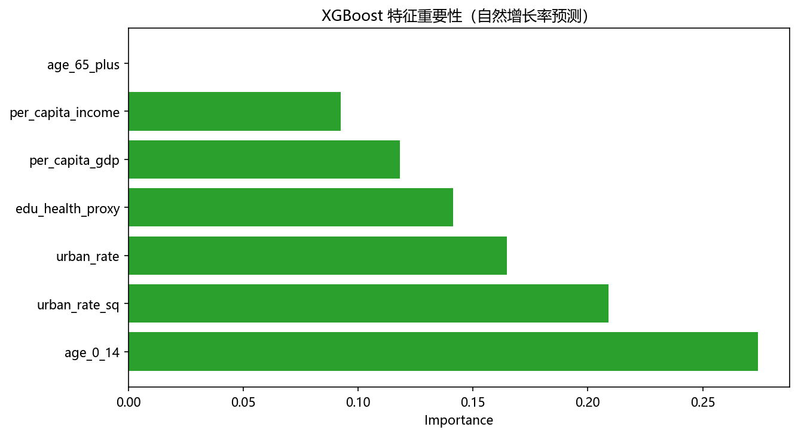

| 特征 | 重要性 / 系数方向 | 解释 |
|---|---|---|
| `age_0_14` | 重要性最高，系数为正 | 儿童占比越高，自然增长率越高 |
| `urban_rate_sq` | 重要性靠前，系数为正 | 城镇化存在边际递减特征 |
| `urban_rate` | 重要性靠前，系数为负 | 城镇化越高，出生与自然增长压力越大 |
| `edu_health_proxy` | 中等重要性，系数为正 | 代表公共服务和城市承载的代理变量 |
| `per_capita_gdp` / `per_capita_income` | 重要性较低 | 经济水平对自然增长率的直接解释力弱 |
| `age_65_plus` | 重要性接近 0 | 原因是城市层面的年龄结构缺少真实逐城面板，只能用全国代理 |

### 4.3 真实 vs 预测

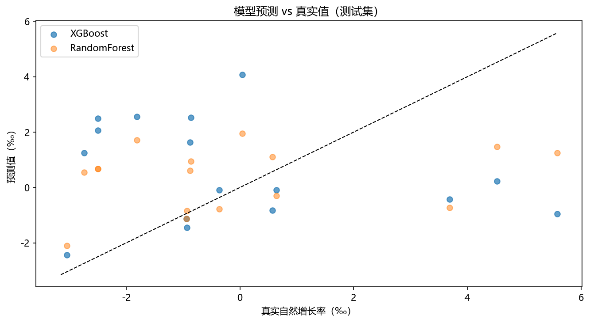

- 预测散点明显偏离理想对角线，说明在真实数据条件下，模型更多是在复现方向而不是追求高拟合度。
- 这也印证了真实人口问题的复杂性：地区差异、政策差异和迁移流动都会压过简单线性关系。

## 五、文本分析

### 5.1 方法与样本

- 文本来源：北京、上海、广州、深圳、成都 5 个城市的统计公报或人口普查公报摘录。
- 方法：中文分词、停用词过滤、TF-IDF 关键词提取、词云展示。
- 这部分对应作业中“3-5 个城市代表性文本”的要求。

### 5.2 词云与关键词

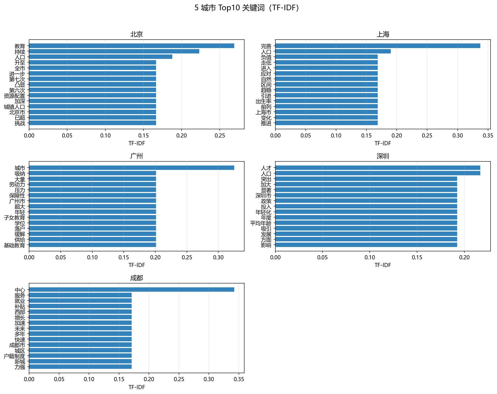

- 北京的关键词更偏向“教育、挑战、城镇人口、资源配置”。
- 上海更突出“完善、出生率、自然、负值、引进”。
- 广州突出“年轻、基础教育、落户、学位、劳动力”。
- 深圳突出“人才、年轻化、投入、发展、平均年龄”。
- 成都突出“中心、户籍制度、新城、就业、服务”。

### 5.3 与数据结果的交叉讨论

- 北京、上海的文本中反复出现老龄化、出生率走低和公共服务压力，这与自然增长率的负值趋势一致。
- 深圳、广州更强调人才吸引和年轻人口，这与它们在样本中保持相对较高的自然增长率一致。
- 成都的文本更强调产业承载和就业扩张，和西部中心城市的人口集聚逻辑一致。

## 六、关键结论

1. 真实数据下，人口变化方向是清楚的：武汉、杭州、长沙、郑州、深圳的人口吸引力最强。
2. 自然增长率下行是整体性趋势，不是个别城市现象；在清洗后的样本中，已经有 28 条记录为负值。
3. 模型 R² 较低并不意外，因为关键结构变量缺少逐城面板，真实数据里噪声远大于合成数据。
4. 文本分析与数值结果相互印证，统计公报里强调的老龄化、人才吸引、教育和公共服务扩容，和人口变化方向一致。

## 七、可交付代码与产物

- 真实数据加载：`code/01b_load_real_population.py`
- 清洗与可视化：`code/02_clean_explore.py`
- 因素建模：`code/03_model_factor.py`
- 文本分析：`code/04_text_analysis.py`
- 数据：`data/{city,provincial,national}.parquet`、`data/pop_basic.csv`、`data/pop_basic_clean.csv`
- 图形：`figures/fig01_pop_trend.png` 至 `figures/fig12_top_keywords.png`

## 八、说明

- 本作业最终保留的是能够直接产出真实图表和真实分析结果的脚本链路。
- 由于官方公开数据本身存在缺年和口径差异，报告中对城市层面的年龄结构、城镇化率等指标明确标注为全国代理值或近似值，不再把它们写成城市级真实观测值。