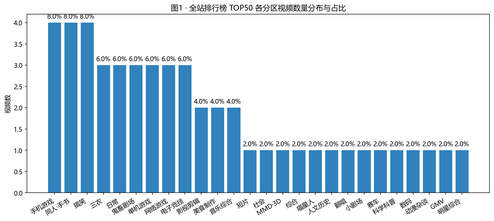
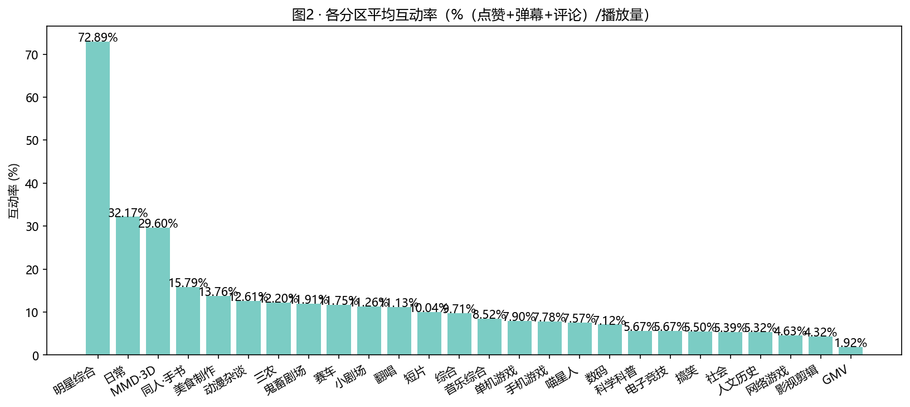
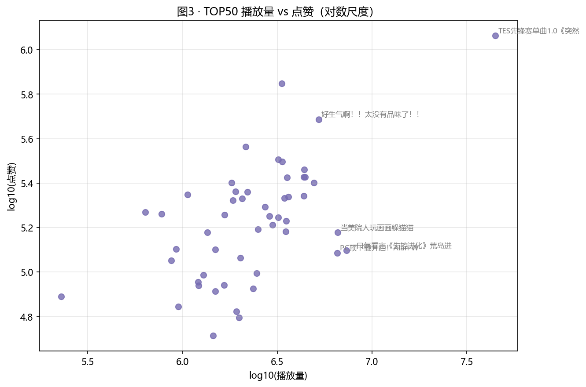
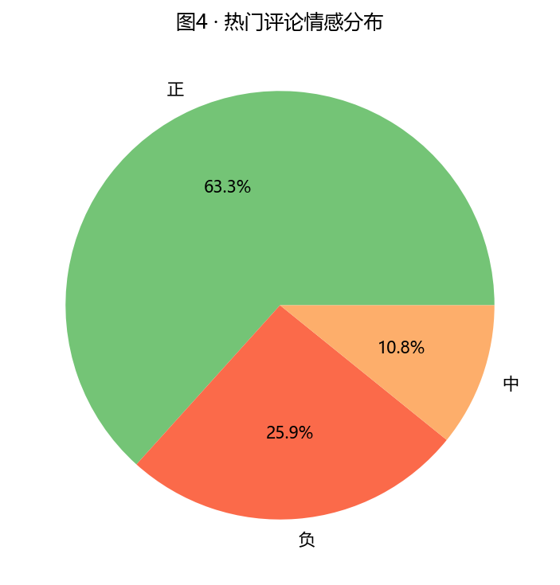
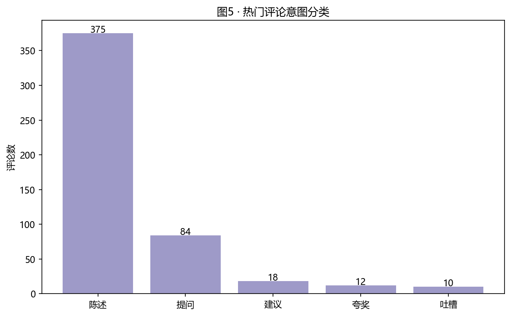
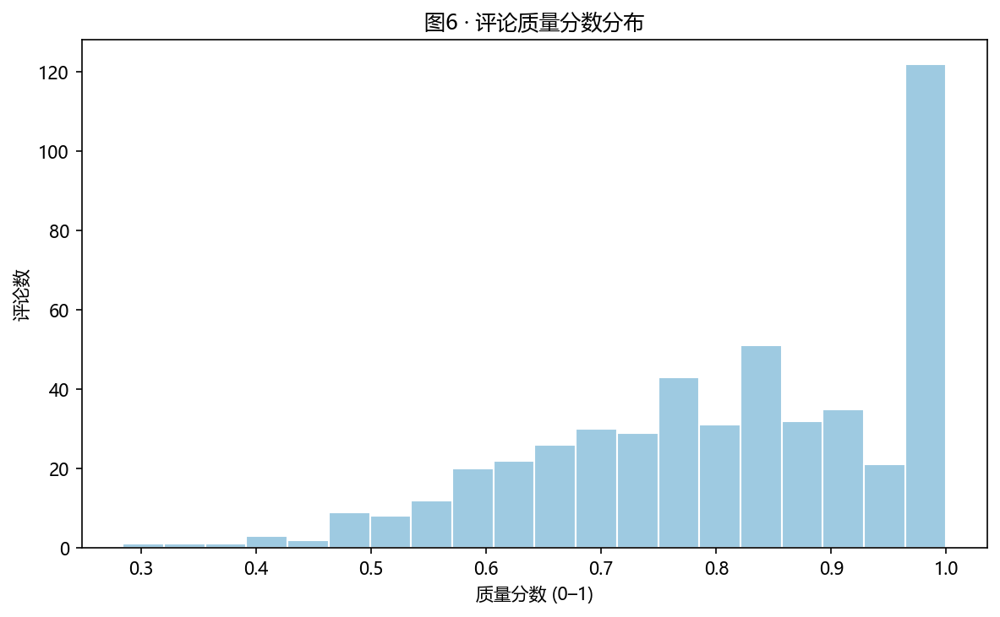
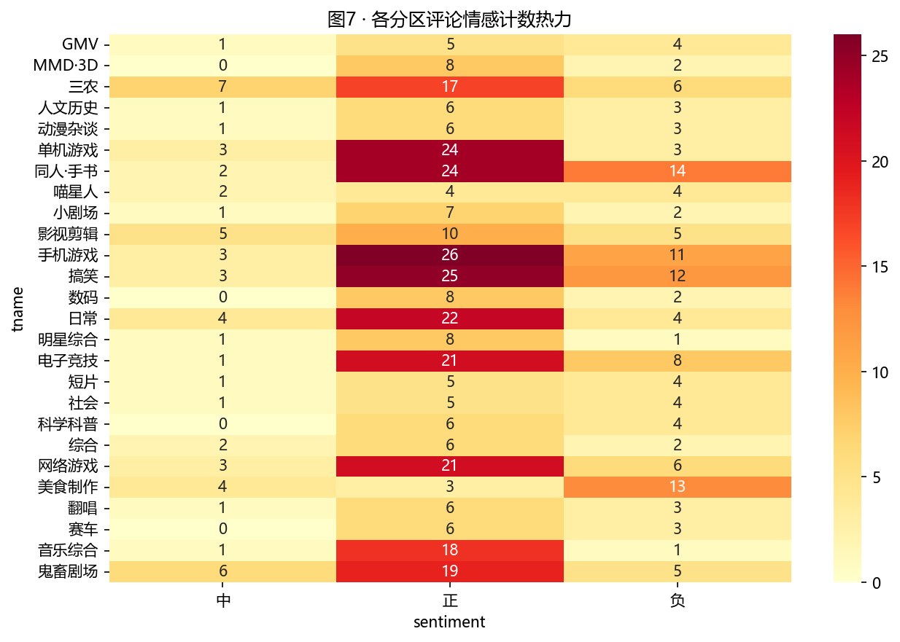
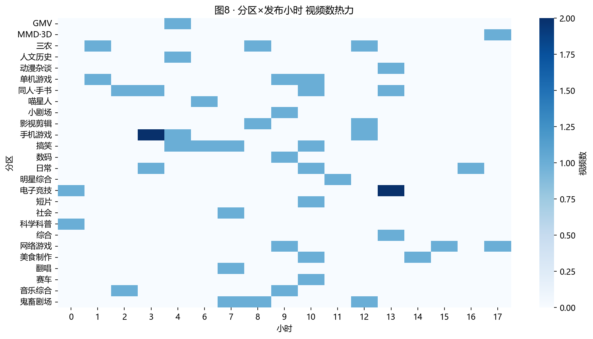
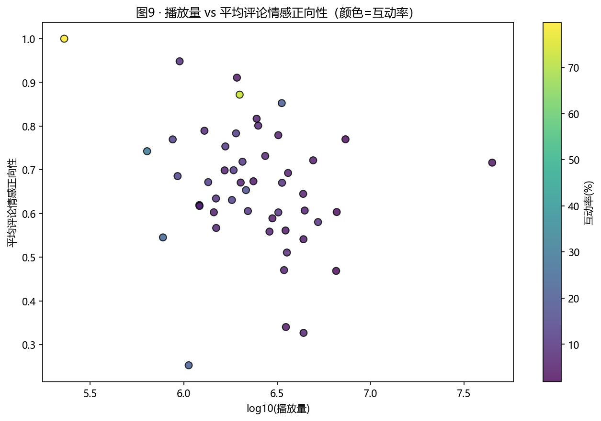

# 作业二 · B 站全站排行榜视频与热门评论分析（真实数据版）

## 一、研究目标

1. 爬取 B 站全站排行榜前 50 个视频的基本信息、播放/互动指标及分区。
2. 对各分区内容表现差异进行可视化与统计。
3. 对每个视频的热门评论做情感倾向、意图与质量的多维分析。
4. 进一步从发布时间、播放表现与评论情绪的关系做扩展观察。

## 二、数据来源与方法

本次作业使用的是真实接口抓取结果，不再采用离线样本。重新运行后，`data/top_videos.csv` 共 50 条视频记录，`data/hot_comments.csv` 共 499 条热门评论记录，两个文件中的 `data_source` 字段均为 `real`。

- 排行榜接口：`https://api.bilibili.com/x/web-interface/ranking/v2?rid=0&type=all`
- 视频详情接口：`https://api.bilibili.com/x/web-interface/view`
- 热门评论接口：`https://api.bilibili.com/x/v2/reply/main`，使用 `mode=3` 获取热门评论

脚本已经配置了随机 User-Agent、Referer、登录态 Cookie 和重试机制。当前环境下使用已有的 `SESSDATA` 后，爬虫成功走通了真实接口，没有触发样本兜底。

## 三、分区内容表现

### 3.1 各分区视频数量分布

TOP50 的分区分布比较集中，数量最多的是手机游戏、同人·手书和搞笑，均为 4 条；紧随其后的是三农、日常、鬼畜剧场、单机游戏、网络游戏和电子竞技，均为 3 条。说明当前排行榜头部并不是单一分区垄断，而是多个娱乐和内容生产型分区共同占据高位。

### 3.2 各分区平均互动率

按互动率排序，表现最突出的分区包括明星综合、日常和 MMD·3D，其中明星综合的平均互动率最高，但它只有 1 条样本，因此更适合当作个例参考，不宜过度外推。若看样本量更稳定的分区，同人·手书、美食制作、动漫杂谈、三农和鬼畜剧场也保持了较高互动率，说明内容的表达方式、社区属性和话题热度都会显著影响互动。

### 3.3 播放量 vs 点赞

播放量与点赞量呈明显正相关。基于当前 50 条视频计算，播放量与点赞量的相关系数约为 0.80，播放量与评论数的相关系数更高，约为 0.96，说明热视频通常会同时带来更高的点赞和更多互动。少数视频显著高于趋势线，可视为更强的爆款信号。

## 四、评论多维度分析

### 4.1 情感倾向

499 条热门评论中，正向评论占 63.33%，负向评论占 25.85%，中性评论占 10.82%。整体上，排行榜头部视频的评论区仍以正向反馈为主，但负向评论并不算少，说明热门内容的讨论热度和争议性是并存的。

### 4.2 评论意图

评论意图以“陈述”为主，占 75.15%；其次是“提问”占 16.83%；“建议”“夸奖”“吐槽”占比较低。这个结果和 B 站评论区常见的打卡、接梗、补充信息的社区习惯一致，说明热门视频的评论区更多承担的是围观、记录和补充讨论的功能。

### 4.3 评论质量

评论质量分数均值约为 0.812，中位数约为 0.829，整体分布偏高，说明热门评论普遍不只是短促的“打卡式”回复，也包含一定长度和一定点赞支持的内容。结合分布图看，优质评论集中在中高分区间，右尾较短。

### 4.4 各分区评论情感热力

各分区的评论情绪结构并不完全一致。内容表达方式更强、社区属性更明显的分区，更容易出现正向情感集中；而争议性更高的分区，负向评论也更容易出现。整体上，这张图与上面的情感分布是一致的。

## 五、扩展挖掘

### 5.1 分区 × 发布小时

当前这批排行榜视频的发布时间主要集中在 9–13 点附近，其中 10 点最多，共 7 条；9 点和 13 点各 5 条。说明“全站排行榜”样本并不是完全随机发布时间，而是存在明显的时段聚集。

### 5.2 播放量 vs 平均评论正向性

播放量更高的视频通常也更容易获得更高的平均正向情绪，说明爆款视频往往会放大正向口碑。结合互动率看，热视频的评论区不只是“看完即走”，而是会形成更强的情绪聚集和二次传播。

### 5.3 热门评论词云

词云中的高频词主要集中在“宝藏”“大佬”“教学”“学到”“收藏”等，体现出 B 站社区中“认可内容价值、强调学习和收藏”的评论文化。

## 六、结论与可落地洞察

1. 当前全站排行榜 TOP50 的分区分布较集中，但不是单一区域垄断，手机游戏、同人·手书、搞笑、三农、日常等分区共同构成了头部样本。
2. 评论区整体情绪偏正向，且以陈述类评论为主，说明热门视频更容易形成“围观 + 记录 + 补充信息”的社区互动。
3. 互动率、播放量、点赞量和评论量之间存在明显正相关，说明排行榜头部内容具备较强的综合传播能力。
4. 发布时间存在明显时段聚集，说明平台头部内容并非完全随机出现在各时段，运营节奏仍然是影响曝光的重要因素。

## 七、关键代码与产物

- 爬虫：`code/01_crawl_bilibili.py`
- 分析与可视化：`code/02_analyze.py`
- 数据：`data/top_videos.csv`、`data/hot_comments.csv`、`data/comments_analyzed.csv`、`data/topic_stats.csv`
- 图形：`figures/fig01_district_count.png` 至 `figures/fig10_wordcloud.png`

## 八、说明

- 本次报告使用的图表均来自最新一轮真实接口抓取后的数据，不再使用离线样本图。
- `top_videos.csv` 和 `hot_comments.csv` 已统一标记为 `real`，便于后续复查来源。