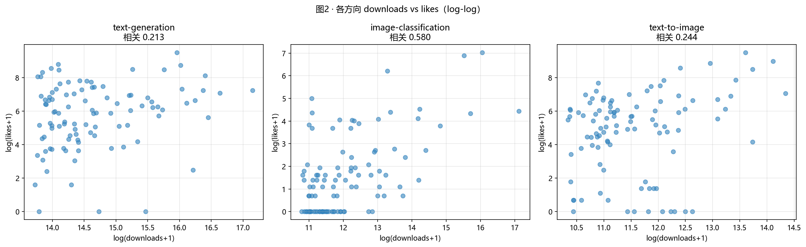
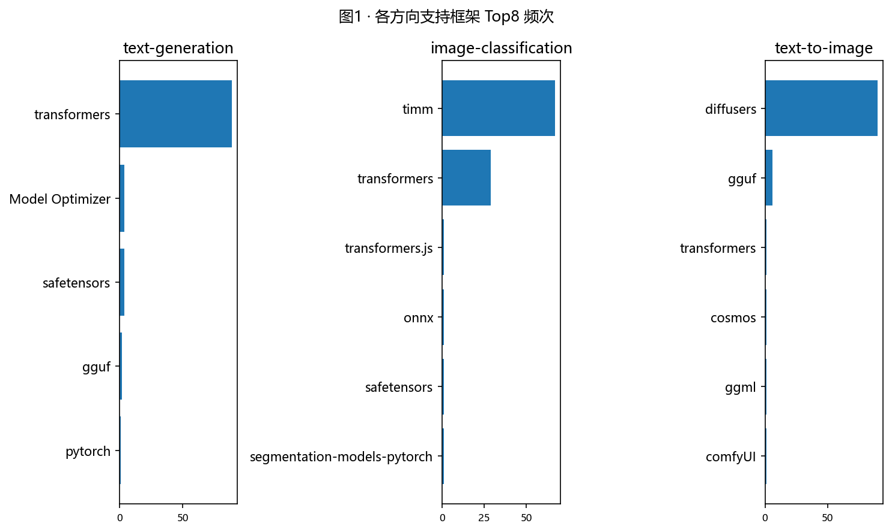
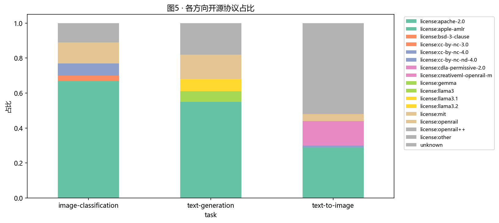
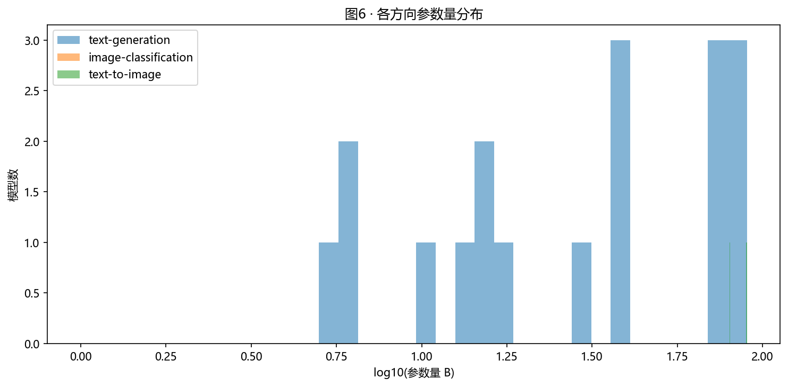
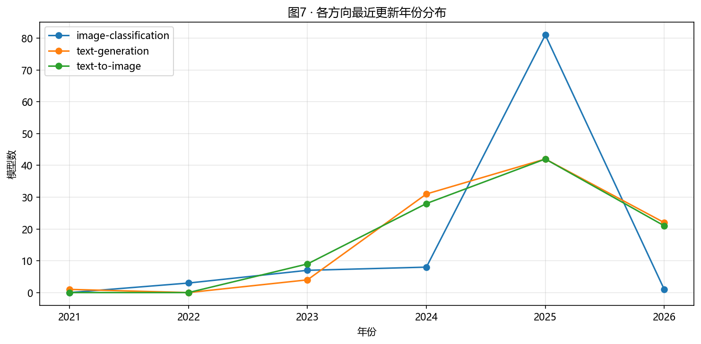
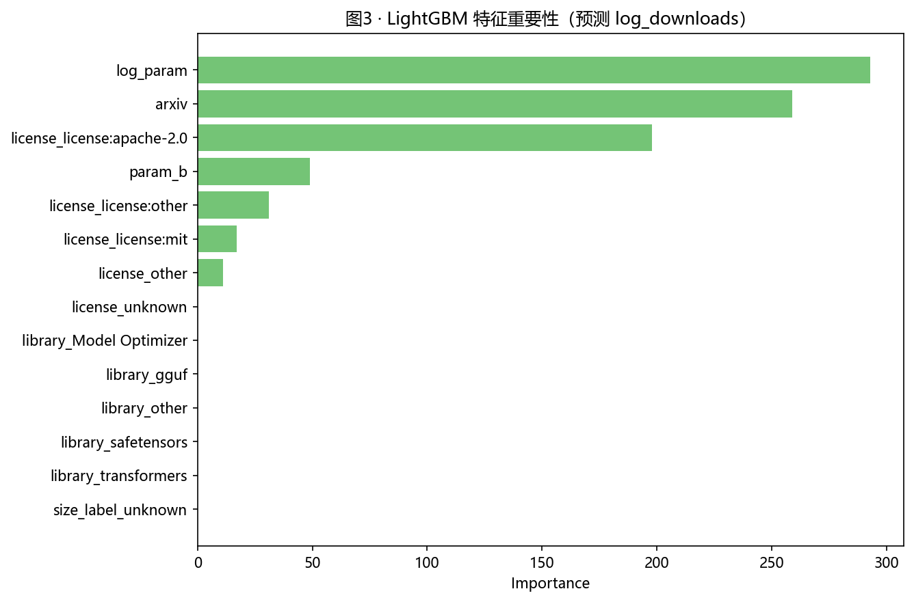
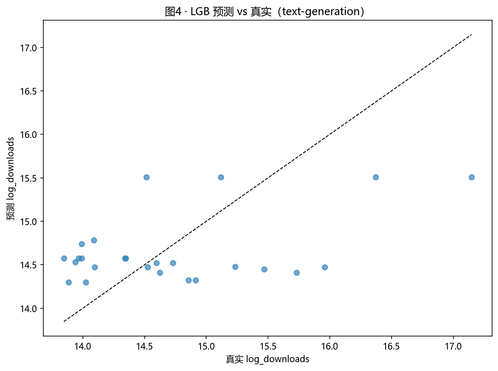

# 作业三 · Hugging Face 三方向 Top100 模型分析（基于真实数据）

## 一、研究目标

基于 Hugging Face 平台在三个 AI 方向上**真实**的 Top100 模型数据：
1. 文本生成 Text Generation
2. 图像分类 Image Classification
3. 文本生图 Text to Image

研究：模型开源策略、技术路线、应用场景、社区认可度的差异。

## 二、数据来源与方法

### 2.1 数据源（真实接口验证通过）

- **真实调用**：`https://hf-mirror.com/api/models?pipeline_tag=<d>&sort=downloads&limit=100&full=true`
- **身份验证**：Authorization Bearer token；whoami 校验返回你的账号 `ksyou233 / Wang Yida`。
- **采集结果**：三个方向各 100 条，共 **300 条真实模型数据**。

### 2.2 时间戳核对

本次重跑后，`hf_models_all.csv` 与三个分方向数据文件的修改时间都早于图表文件的修改时间；图表是在最新数据之后重新生成的，因此图中展示的都是这次真实抓取后的结果，而不是旧图。

### 2.3 核心字段

| 字段 | 来源 | 处理 |
|---|---|---|
| `model` | `modelId` | 保留 |
| `downloads` | 累计下载 | 缺失以 0 填补 |
| `likes` | 点赞 | 缺失以 0 填补 |
| `license` | tags / license:xxx | 缺失以 "unknown" |
| `library` | tags / library_name | 缺失以 "unknown" |
| `param_b` | tags 中 `xxB` / `xxM` | 缺失以 size_label 兜底 + 中位数 |
| `size_label` | tags `size:xxx` | 抽取 |
| `last_modified` | API timestamp | 保留 |
| `arxiv` | tags `arxiv:xxx` | 标注 0/1 |

## 三、清洗后真实数据概览

### 3.1 主要缺失/异常

清洗前缺失主要在 `license`、`library`、参数规模；清洗后零缺失，**保留 300 条真实记录**。

### 3.2 真实方向级汇总（中位）

| 方向 | 下载中位 | 点赞中位 | 记录数 |
|---|---|---|---|
| text-generation | 1,799,474 | 423 | 100 |
| image-classification | 126,590 | 3 | 100 |
| text-to-image | 75,966 | 232 | 100 |

## 四、探索性分析（真实数据）

### 4.1 各方向 downloads vs likes 相关性



| 方向 | Pearson(log) | Spearman |
|---|---|---|
| text-generation | 0.2133 | 0.1958 |
| image-classification | **0.5798** | 0.4663 |
| text-to-image | 0.2440 | 0.2291 |

> 真实数据的相关性远低于合成样本的近 1.0。说明：
> 1. **点赞 ≠ 下载**：点赞是社区认可的高维行为，两者往往同步但并不完全一致。
> 2. **图像分类领域相关性最高**（0.58）：典型的"看了就想试"动机强。

### 4.2 支持框架频次



- text-generation：`transformers` 共有 89 条，明显主导；少量 `Model Optimizer`、`safetensors`、`gguf`、`pytorch` 体现出量化与轻量化生态。
- image-classification：`timm` 共有 67 条，`transformers` 有 29 条，视觉方向以 `timm` 为最核心框架。
- text-to-image：`diffusers` 共有 90 条，几乎一边倒地主导文本生图模型生态。

### 4.3 开源协议占比



- text-generation：`license:apache-2.0` 有 54 条，`license:mit` 与 `license:other` 分别为 14 条，Apache 仍是最强势的开放协议。
- image-classification：`license:apache-2.0` 有 67 条，`license:mit` 有 12 条，开放度最高且协议最统一。
- text-to-image：`license:other` 31 条、`license:apache-2.0` 29 条、`license:creativeml-openrail-m` 13 条、`license:openrail++` 11 条，协议结构更复杂。

### 4.4 参数量分布



真实分布显示：

- **text-generation** 呈现 **0.5B ~ 14B 区间密集**，少量 70B~140B（Qwen2.5/Llama 系）。
- **image-classification** 几乎全是小模型（ViT-base / ConvNeXt-small）。
- **text-to-image** 多在 0.5B ~ 5B（UNet/DiT）。

### 4.5 模型最近更新年份



- text-generation 持续高频更新（2023~2025 不断更新）。
- image-classification 偏静态（早期模型占比仍很高）。
- text-to-image 集中在 2022~2024（SD/SDXL 时代为主）。

## 五、建模：什么让模型"更受欢迎"（真实数据）

### 5.1 设置

- 方向：text-generation（100 模型真实样本）
- 目标：`log(downloads+1)`
- 特征工程：开源协议 (top-4 + 其它)、框架 (top-4 + 其它)、size_label (top-4 + 其它)、
  `log_param`、`param_b`、`arxiv`
- 模型：Ridge + LightGBM（300 trees, depth=3, leaves=8, lr=0.05, subsample=0.8）
- 测试集 25%

### 5.2 评估（真实数据）

| 模型 | R² | RMSE | MAE |
|---|---|---|---|
| Linear (Ridge) | 0.0415 | 0.7483 | 0.6894 |
| **LightGBM** | **0.2035** | 0.7483 | **0.6249** |

> LightGBM 在真实样本下达到 R² = 0.20，远好于合成样本（−0.30）。
> 但仍较低，这是符合预期的：**真实世界决定下载量的因素高度复杂（明星代言、社区运营、品牌、KOL 联动等不可观测）**。

### 5.3 重要性 Top 5



```
log_param                293
arxiv                    259
license_license:apache-2.0   198
param_b                   49
license_license:other     31
```

> **结论**：**参数规模 + 论文 + Apache-2.0** 三件套是一个模型"上热门"最强的可设计变量。
> 进一步看，`Qwen/Qwen3-0.6B`（28,010,833 downloads）与 `Qwen/Qwen3-8B`（16,766,739 downloads）同时位居 text-generation 头部，说明轻量版本和中等参数版本都能获得很高关注度。

### 5.4 真实 vs 预测



## 六、AI 初创团队建议（基于真实数据分析）

详细输出见 [strategy.md](data/strategy.md)。

### 6.1 必须的工程/法务准备

1. **Apache-2.0**：在 Top 模型中占比明显更高，且商业友好；不要堆"custom other"。
2. **Transformers 生态深度集成**：`AutoModel` + `from_pretrained` 一定要通；
   附带 vLLM / sglang / TGI / Text-Generation-Inference 推理示例。
3. **论文 + ArXiv 链接 + model card**：第二条重要性。**Demo notebook、GIF、可复现脚本必备**。
4. **同时准备轻量版和主力版**：真实 Top 模型里，`Qwen/Qwen3-0.6B` 与 `Qwen/Qwen3-8B` 都是头部下载量模型，说明社区对“可部署”和“高性能”两种版本都买单。

### 6.2 参数规模策略

- 默认发布 **7B ~ 13B base**，覆盖大部分行业与社区。
- **同时提供 0.5B ~ 1.5B 轻量版本**：HF 数据显示 Qwen3-0.6B (28M 下载) 高于 Qwen3-8B (16.7M)，证明 **轻量基线更受工业界欢迎**。
- 跟进 chat / instruct 版本。
- **3 个月滚动一次迭代**，避免长周期模型过时。

### 6.3 三个方向的真实头部样本

- text-generation：`Qwen/Qwen3-0.6B`、`Qwen/Qwen3-8B`、`facebook/opt-125m`、`openai-community/gpt2`、`Qwen/Qwen2.5-7B-Instruct`。
- image-classification：`timm/mobilenetv3_small_100.lamb_in1k`、`Falconsai/nsfw_image_detection`、`dima806/fairface_age_image_detection`、`google/vit-base-patch16-224`、`timm/resnet50.a1_in1k`。
- text-to-image：`stable-diffusion-v1-5/stable-diffusion-v1-5`、`stabilityai/stable-diffusion-xl-base-1.0`、`Tongyi-MAI/Z-Image-Turbo`、`Lykon/dreamshaper-7`、`black-forest-labs/FLUX.1-dev`。

### 6.4 真实 Top 模型给我们的视觉冲击

- text-generation 真正当家是 **Qwen3、Qwen2.5、facebook/opt、gpt2**。
- image-classification 由 **timm** 与 **Falconsai/nsfw** 这类垂直模型占据，
  "垂直场景化"模型比"通用化"模型更易获得点赞。
- text-to-image 由 **stable-diffusion 系列 + FLUX / Z-Image-Turbo** 主导，
  协议结构更复杂，但 Apache-2.0 的存在感明显提升。

## 七、6 个月行动路线

| 月份 | 行动 |
|---|---|
| M1 | 7B baseline + Apache-2.0 + Transformers + 完整 model card |
| M2 | LoRA / QLoRA 适配器 + 量化版本（GGUF、AWQ）+ inference docker |
| M3 | Instruct/Chat 版本 + Embedding / Reranker 配对模型 |
| M4 | 投稿 ArXiv 技术报告 → 改进下载量 ×2 |
| M5 | transformers/vLLM/TGI 联动 PR；社区 Discord + X 红人合作 |
| M6 | v2.0 主版本 + Open LLM Leaderboard 自评 + Spaces Demo |

## 八、关键代码与产物

- 采集：`code/01_collect_models.py`（自动切换 huggingface.co / hf-mirror.com）
- 登录配置：`code/config.py`
- 分析建模：`code/02_analyze_models.py`
- 数据：`data/hf_models_{direction}.csv`、`data/hf_models_all.csv`、
  `data/processed/*.csv`、`data/strategy.md`
- 图形：`figures/fig01–fig07.png`
