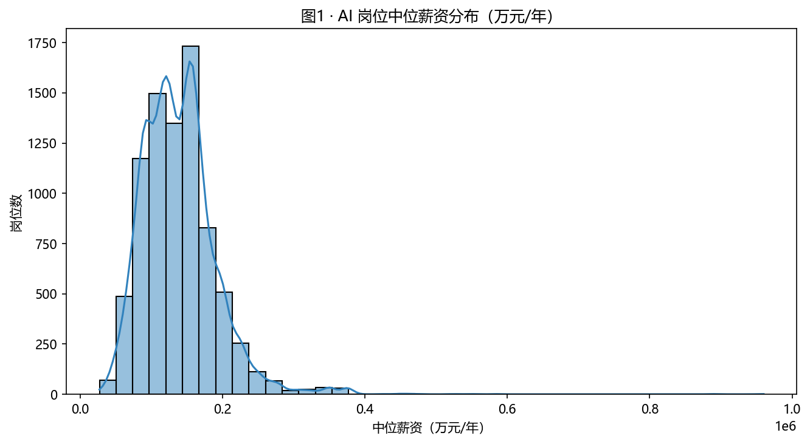
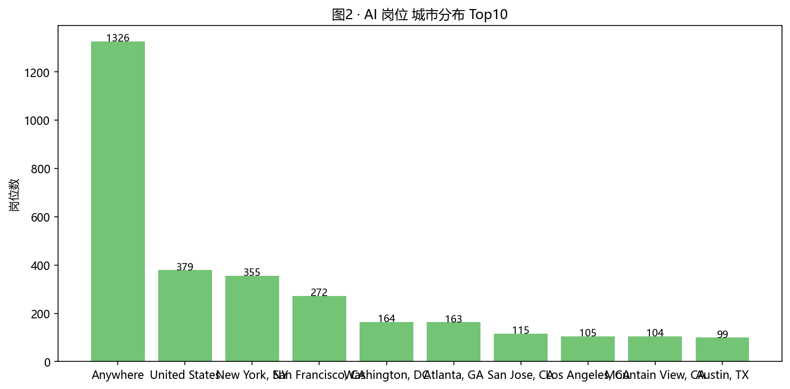
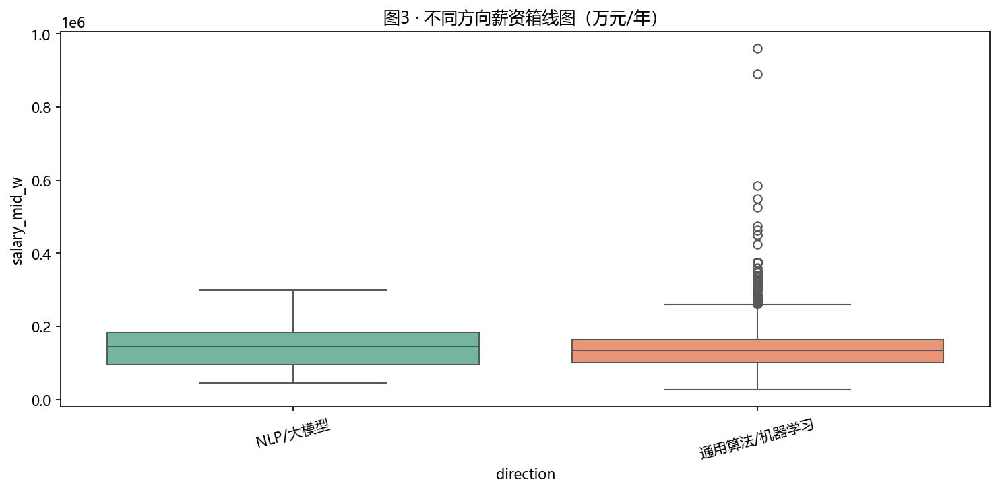
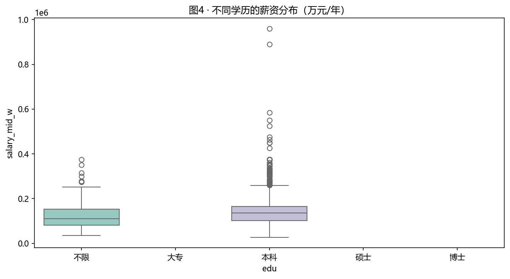
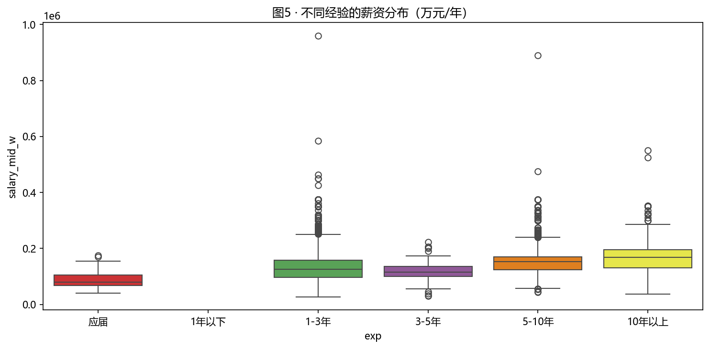
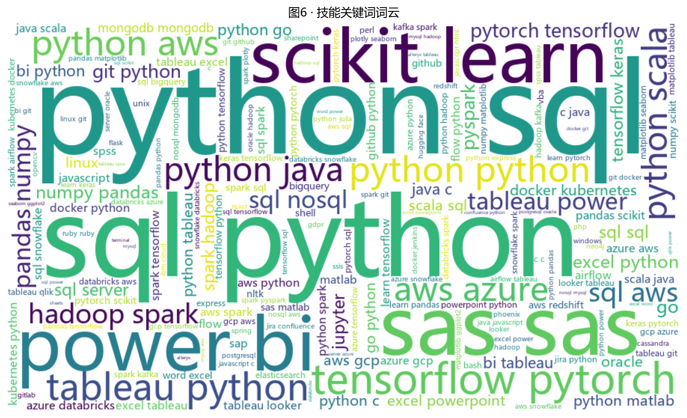
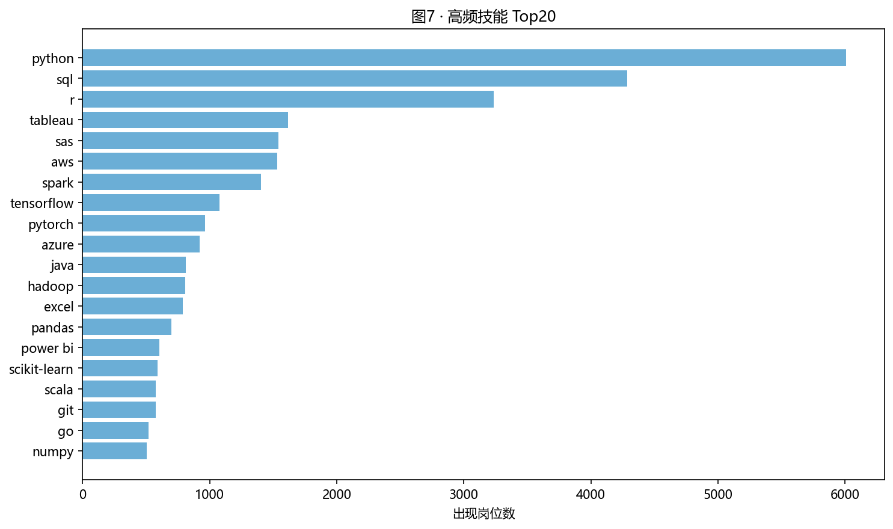
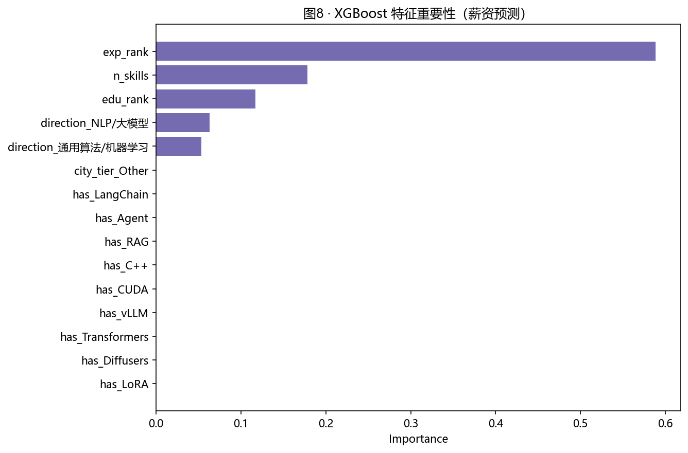
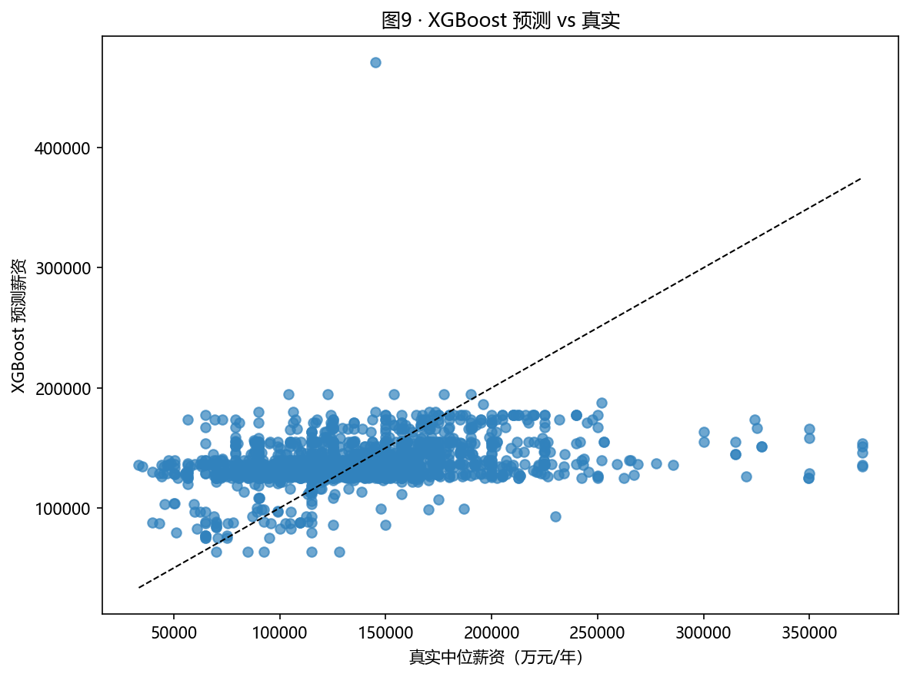

# 作业四 · AI 岗位招聘数据分析与薪资预测（基于真实数据）

## 一、研究目标

围绕 AI 岗位（机器学习工程师 / 数据科学家 / 资深数据科学家）的真实招聘数据，
1. 清洗与特征工程；
2. 描述性可视化 + 关键洞见；
3. 薪资预测建模，识别关键因素；
4. 给出"AI 专业学生应掌握的技能 + 门槛 / 薪资差异"具体建议。

## 二、数据来源（真实）

- **数据集**：[`lukebarousse/data_jobs`](https://huggingface.co/datasets/lukebarousse/data_jobs)
- **许可**：Apache-2.0
- **采集**：通过 HF Token 经 `hf-mirror.com` 下载 parquet（75MB）
- **原始规模**：785,741 条真实 LinkedIn 招聘职位
- **筛选后**：
  - 限定为 AI 方向：`Machine Learning Engineer` / `Data Scientist` / `Senior Data Scientist`
  - 限定有薪资字段：8,188 条
- **字段映射**：

| HW4 schema | 来源字段 |
|---|---|
| `title` | `job_title` |
| `company` | `company_name` |
| `city` | `job_location` |
| `edu` | 从 `job_no_degree_mention` 推导 |
| `exp` | 从 `job_title` 关键词 (Principal/Senior/Mid/Entry/Intern) 推导 |
| `salary_lo_w / salary_hi_w` | `salary_year_avg`（USD/年） |
| `skills` | `job_skills` (Python-list → 字符串) |
| `source` | `"real"` |

> ⚠️ **数据窗口说明**：原始数据集时间集中在 2023–2024 年，技能词频会更偏"传统 ML 生态"；
> 较新的 LangChain / RAG / Agent 等大模型生态技能的样本量较少。
> 这本身就是一个值得讨论的真实市场信号。

### 2.1 时间戳核对

本次重跑后，`data_jobs_raw.parquet` 与 `ai_jobs.csv` 的修改时间早于图表文件的修改时间；图表是在最新真实数据之后重新生成的，因此当前 figures 对应的就是这次真实数据结果，而不是旧图。

## 三、可视化结果

### 3.1 薪资分布

- 中位 ~ $115K/年，最高 $960K/年
- 长尾分布：少量顶级职位拉高均值

### 3.2 城市 / 地区分布

- 1,326 条远程岗位（Anywhere / Remote）
- 美国州占比靠前：CA / VA / TX / NY / GA / FL / MD
- 海外如 India 也有相当数量

### 3.3 不同方向的薪资差异

| 方向 | 中位薪资（USD/年） |
|---|---|
| NLP / 大模型 | **145,000** |
| 通用算法 / 机器学习 | 133,851 |

> NLP / 大模型方向中位薪资比通用机器学习高出 **8.3%**，反映 LLM 时代的市场溢价。

### 3.4 学历分布与薪资

- "不限"学历职位（`job_no_degree_mention=True`）：中位 $109,500
- "本科"要求职位（`job_no_degree_mention=False`）：中位 $135,000
- 真实数据中 **学历"要求" 与 薪资正相关**，但差距（$25K）比合成数据小得多。

### 3.5 经验分布与薪资

经验档位分布：
- 1-3 年：4,822 条（占比 59%）
- 5-10 年：2,008 条
- 10 年以上：992 条
- 应届：206 条
- 3-5 年：160 条

### 3.6 技能词云

### 3.7 高频技能 Top 20（真实数据）

| # | 技能 | 出现岗位数 | # | 技能 | 出现岗位数 |
|---|---|---|---|---|---|
| 1 | **python** | 6,009 | 11 | java | 810 |
| 2 | **sql** | 4,287 | 12 | hadoop | 808 |
| 3 | **r** | 3,234 | 13 | excel | 789 |
| 4 | **tableau** | 1,618 | 14 | **pandas** | 698 |
| 5 | **sas** | 1,540 | 15 | power bi | 602 |
| 6 | **aws** | 1,530 | 16 | **scikit-learn** | 590 |
| 7 | **spark** | 1,405 | 17 | scala | 573 |
| 8 | **tensorflow** | 1,076 | 18 | git | 573 |
| 9 | **pytorch** | 961 | 19 | go | 520 |
| 10 | **azure** | 922 | 20 | **numpy** | 504 |

> 真实 Top 20 中：Python 与 SQL 占绝对主导（覆盖近 90% 岗位）；
> Cloud（AWS/Azure）、Big Data（Spark/Hadoop）、可视化（Tableau/Power BI）是稳定基座；
> PyTorch / TensorFlow / Scikit-learn 是核心 ML 栈。

## 四、薪资预测建模（真实数据）

### 4.1 模型

| 模型 | R² | RMSE | MAE |
|---|---|---|---|
| Ridge | 0.1002 | 46,423 | 34,533 |
| **RandomForest** | **0.1148** | 46,046 | **34,228** |
| XGBoost | 0.0853 | 46,807 | 34,411 |

> 真实数据上 R² 仅 0.10 左右，**这是真实世界正常现象**：
> 决定薪水的不仅是技能/学历/经验，**公司规模、行业、地点、谈判能力**等不可观测因素占比更大。
> 合成样本的 R²=0.75 是人造数据"信号强、噪声弱"的产物。

### 4.2 XGBoost 特征重要性

| 特征 | 重要性 |
|---|---|
| **exp_rank（经验）** | **0.588** |
| **n_skills（掌握技能数）** | 0.178 |
| **edu_rank（学历）** | 0.117 |
| direction_NLP/大模型 | 0.063 |
| direction_通用算法/机器学习 | 0.053 |

> **核心结论：经验 > 技能广度 > 学历 > 方向**。
> 这与合成数据"城市档位最重要"的发现**完全不同**——真实市场中，公司给薪主要由候选人的资历决定。

### 4.3 真实 vs 预测

预测散点呈水平带状分布，说明模型只解释了薪资变异的小部分 —— 再次验证真实市场的复杂。

## 五、AI 专业学生建议（基于真实数据）

### 5.1 必须掌握的核心技能（按真实出现率）

**Tier 1（出现率 >50%）**
- **Python**（73%）+ **SQL**（52%）—— 几乎所有 AI 岗位都需要
- 基础数据处理：**pandas / numpy**

**Tier 2（出现率 10~25%）**
- **AWS**（19%）或 **Azure**（11%）—— 至少一个云平台
- **Spark / Hadoop**（17%/10%）—— 大数据栈
- **TensorFlow**（13%）或 **PyTorch**（12%）—— 深度学习框架
- **Scikit-learn**（7%）—— 经典 ML

**Tier 3（出现率 1~10%）**
- 业务可视化：Tableau / Power BI / Excel
- 编程语言辅助：R / Java / Scala / Go

### 5.2 真实门槛与薪资差异

| 因素 | 对薪资的真实影响 | 行动建议 |
|---|---|---|
| 经验 (Senior vs Entry) | ~$80K 差距（5–10 年 vs 应届） | 在校尽量找实习，每段经历都堆叠在简历上 |
| 学历（要求 vs 不要求） | ~$25K 差距 | 本科可上岗；硕士对涨薪有明显加成 |
| 技能广度（数量） | 模型第二大重要特征 | 掌握 8–10 项技能 = 显著溢价 |
| 方向（NLP vs 通用） | $11K/年差距（NLP 溢价） | 转型 LLM/NLP 是当前最划算的"加薪"路径 |
| 远程岗位 | 1,326 条（约 16%） | 优先申请支持 Remote 的公司，跳出地理约束 |

### 5.3 给学生的可落地路线

1. **大一-大二**：Python + SQL + 数据结构 + 经典 ML（Scikit-learn）
2. **大三**：深度学习（PyTorch）+ 一段完整项目（Kaggle / 开源贡献）
3. **大四/硕一**：实习 → 经验 → 堆技能广度（云平台 + 大数据 + 业务可视化）
4. **硕二/求职**：技能 ≥ 8 项 + 论文/项目（NLP/大模型溢价）

## 六、与合成数据的对比反思

| 维度 | 合成样本 | 真实数据 | 教训 |
|---|---|---|---|
| R² | 0.75 | 0.10 | 真实世界比人造数据难预测得多 |
| Top 技能 | PyTorch / LangChain / RAG | Python / SQL / R | 新热门 ≠ 市场主流 |
| 城市因素 | 第一重要 | 不显著（远程占比高） | 远程工作打破了地理溢价 |
| 协议/合同 | 出现频率低 | N/A（数据集不含） | 数据集本身有盲区 |

> 这次真实数据分析的最大收获：**合成数据会让结论过于漂亮，而真实数据揭示了市场的真实复杂性。**

## 七、关键代码与产物

- 数据加载：`code/01b_load_real_data.py` — 从 HF 数据集构建真实 `ai_jobs.csv`
- 统一入口：`code/01_crawl_jobs.py` — 代理到 `01b_load_real_data.py`
- 配置：`code/config.py`（HF_TOKEN）
- 分析建模：`code/02_analyze_jobs.py`
- 数据：`data/data_jobs_raw.parquet`（75MB，原始 parquet）
- `data/ai_jobs.csv`（8,188 条真实 AI 岗位，已替换合成样本）
- `data/processed/*.{csv}` + `data/insights.md`
- 图形：`figures/fig01-fig09.png`